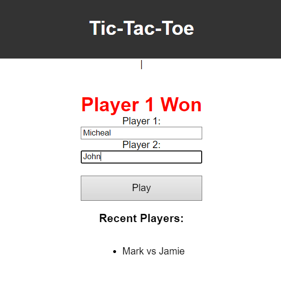
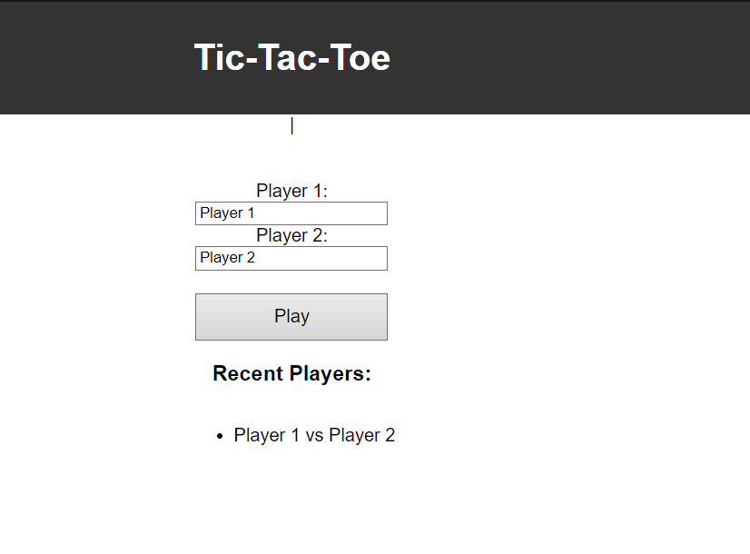
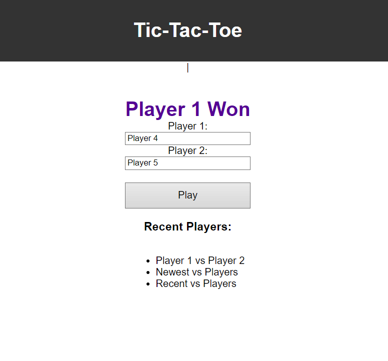
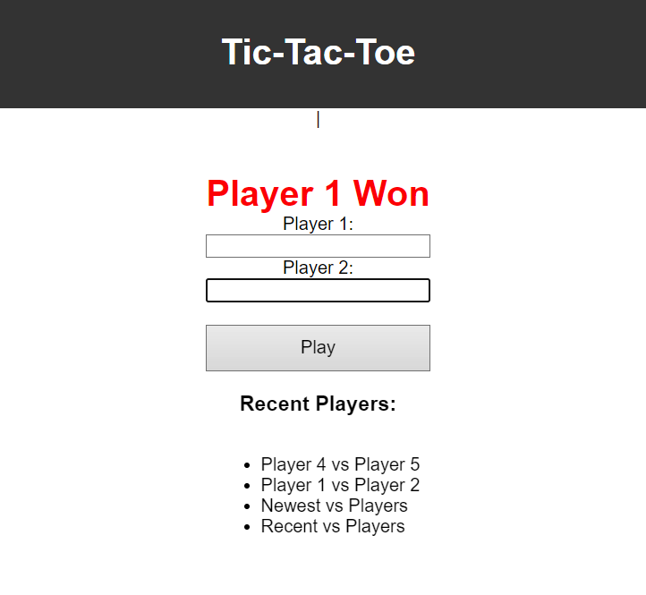

# tic-tac-toe
Tic-Tac-Toe game is implemented using a combination of PHP on the server-side and JavaScript on the client-side.

1. **Initialization**: When the game starts, the init_session() function in PHP is called to initialize the session variables, including isPlayerOneTurn (to keep track of whose turn it is), XOArray (to store the game board state), checkWin (to store the win/draw status), and the player names.The setNames() function is called to set the player names for the current session and add them to the "most recent players" array.

2. **Game Loop**: The client-side JavaScript code (in index.js) sends AJAX requests to the PHP server to handle different game actions.When a player clicks on a cell, the makeMove() function on the server is called with the cell position as a parameter.The makeMove() function updates the XOArray with the current player's symbol ('X' or 'O') and toggles the isPlayerOneTurn variable. After each move, the checkWin() function is called to check if the current player has won or if the game is a draw.

3. **Win/Draw Condition**: The checkWin() function checks all possible winning combinations (rows, columns, and diagonals) to see if the current player has won. If a winning combination is found, the checkWin session variable is set to 2, indicating a win for the current player. If no winning combination is found and all cells are filled, the checkWin session variable is set to 1, indicating a draw. If the game is not over, the 
checkWin session variable is set to 0.

4. **Game State**: After each move or game state change, the getGameState() function is called, which returns the current game state (session variables) as a JSON object. The client-side JavaScript code receives this JSON object and updates the user interface accordingly, displaying the current player's turn, the game board state, and any win/draw messages.

5. **Resetting the Game**: The reset_board() function on the server is called when the user wants to reset the game. It destroys the current session, effectively resetting all game variables.

6. **Serving Static Files**: The PHP code also handles serving static files like index.html, style.css, and index.js to the client.

8. **Resetting the Game**: Clicking the "Reset Game" button calls the `resetGameState` function, which resets the game board and the scores, effectively starting a new game.

9. **Update Game Board**: The updateUI() function iterates over the XOArray received from the server, which represents the current state of the game board.For each cell in the game board, it checks the corresponding value in the XOArray. If the value is 'X', it sets the text content of the corresponding cell element to 'X'. If the value is 'O', it sets the text content of the corresponding cell element to 'O'. If the value is empty, it clears the text content of the corresponding cell element.

10. **Update Recent Players List**: The updateUI() function updates the "Most Recent Players" list in the UI by iterating over the recentPlayers array received from the server. For each player in the array, it creates a new list item element and appends it to the "Most Recent Players" list.

The game continues until a player wins or the game ends in a draw. The client-side JavaScript code handles user interactions and updates the UI based on the game state received from the server.
By updating the UI elements based on the game state received from the server, the client-side JavaScript code ensures that the user interface reflects the current state of the game, including the game board, player turn, win/draw status, and the list of recent players.
