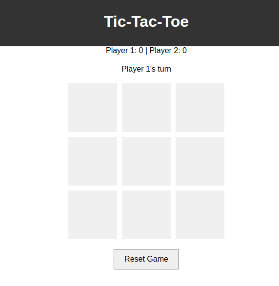
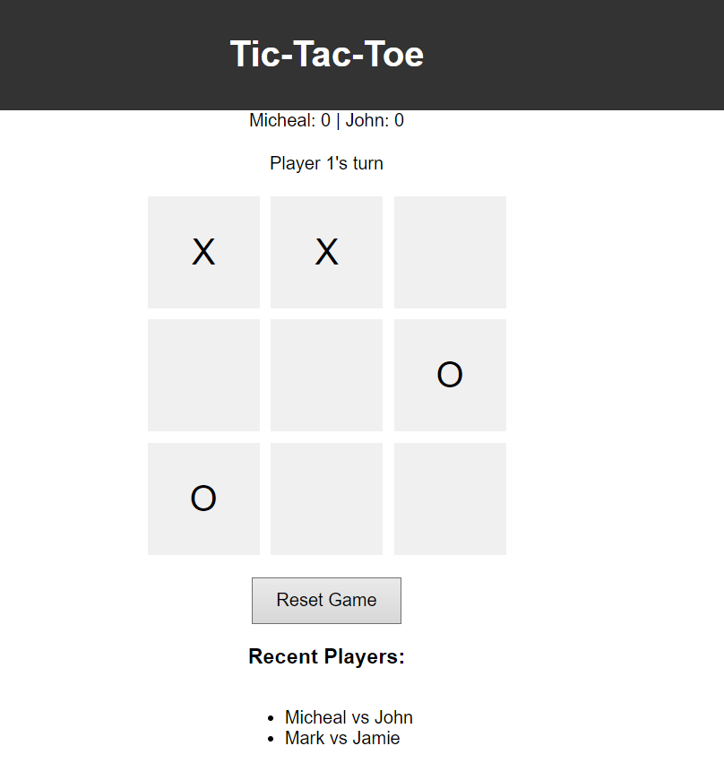
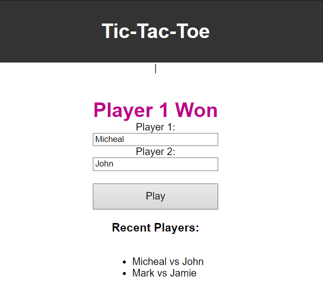
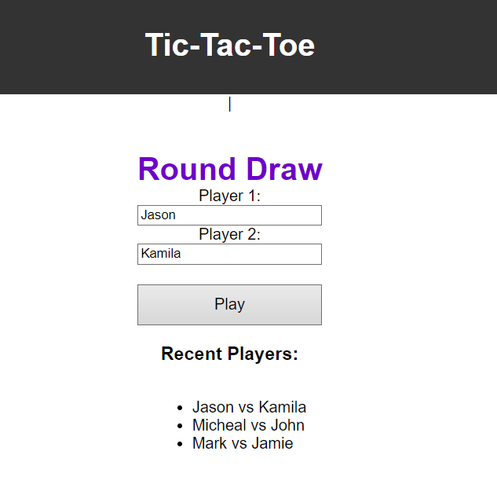

# tic-tac-toe
This is a simple implementation of the classic game of Tic-Tac-Toe.

1. **Initialization**: The game board is represented by an array of cells. Each cell corresponds to a spot on the game board. The game also keeps track of whose turn it is (`isPlayerOneTurn`), the scores of Player 1 and Player 2 (`player1Score` and `player2Score`).

2. **Gameplay**: Players take turns clicking on a cell of the game board. The `handleClick` function is triggered when a cell is clicked. This function updates the cell with the current player's symbol ('X' for Player 1 and 'O' for Player 2), checks if the current player has won with `checkWin`, or if the game is a draw with `checkDraw`.

3. **Winning the Game**: The `checkWin` function checks if the current player's symbols form a winning combination on the game board. The winning combinations are the 8 possible ways to get three in a row in Tic-Tac-Toe: 3 rows, 3 columns, and 2 diagonals.

4. **Draw Condition**: The `checkDraw` function checks if all cells on the board have been filled and no player has won, in which case the game is a draw.

5. **End of Round**: If a player wins or the game is a draw, the `enablePlayAgain` function is called to display the "Play Again" button and hide the game board.

6. **Restarting the Game**: Clicking the "Play Again" button calls the `restartGame` function, which resets the game board and allows the players to start a new round. The scores are not reset.

7. **Resetting the Game**: Clicking the "Reset Game" button calls the `resetGameState` function, which resets the game board and the scores, effectively starting a new game.

8. **Updating the UI**: The `updateUI` function updates the game's user interface to reflect the current state of the game, including the players' scores, whose turn it is, and the winner of the last round.

This game continues until the players decide to stop. The player with the highest score wins. If both players have the same score, the game is a draw.